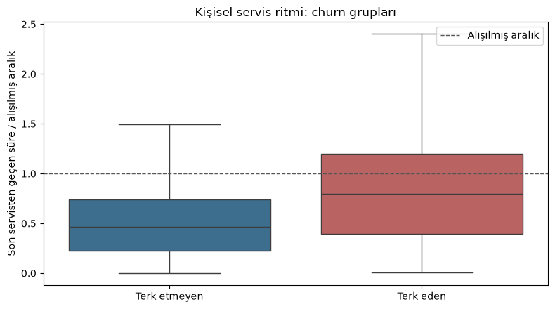
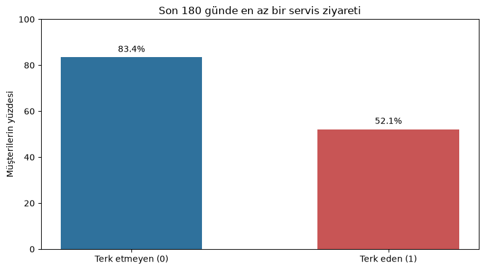
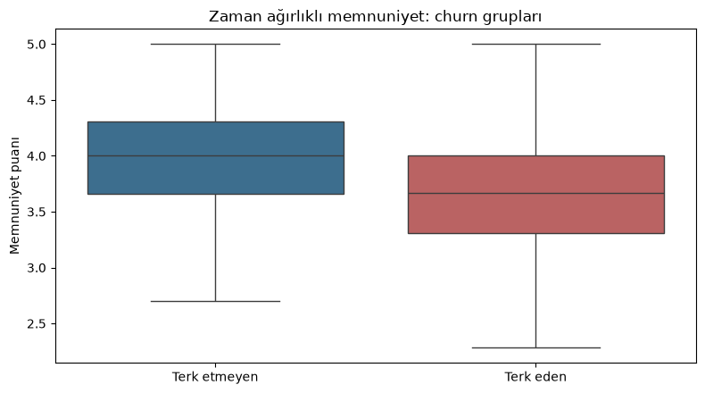
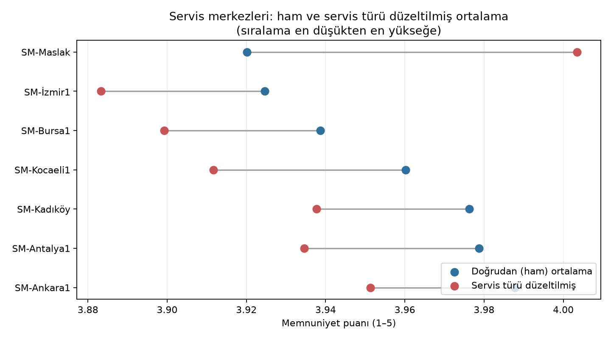
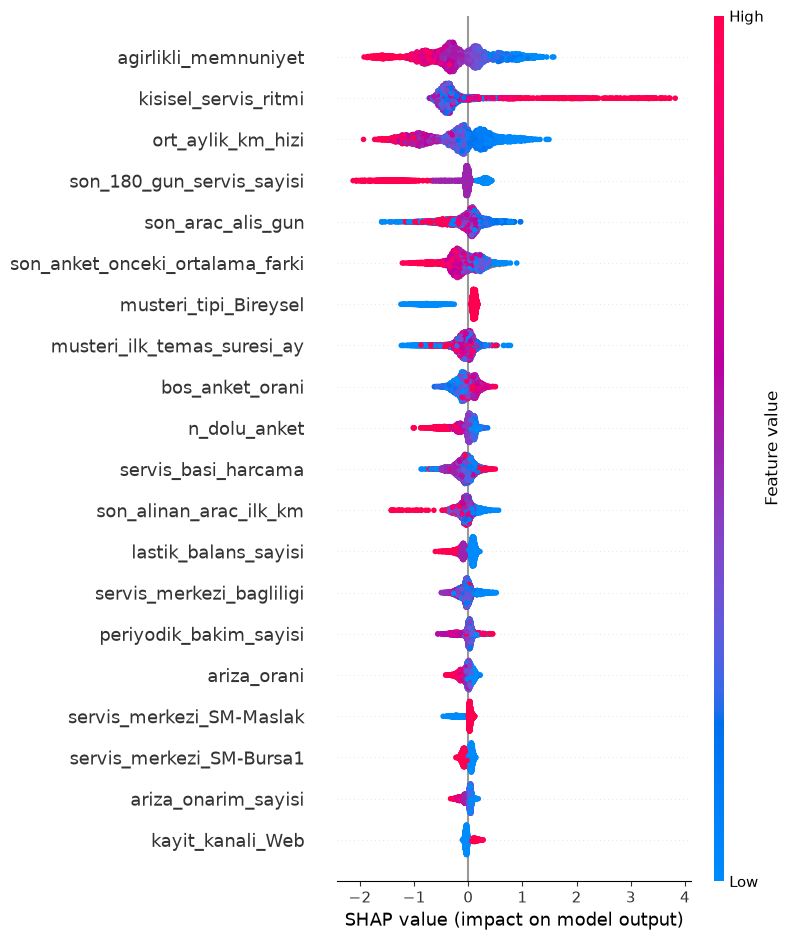

  
# Müşteri terk analizi

**İlgili kod:** [Veri birleştirme ve kaynak kontrolü](kod/veri_analizi.ipynb#kaynak-veriler-baslik) · [Müşteri özellikleri ve model girdisi](kod/veri_analizi.ipynb#musteri-feature-baslik)

**Tarih sınırı:** 30 Haziran 2025, geçmiş servis kayıtlarına dahildir. Churn için 1 Temmuz 2025–30 Haziran 2026 arasına baktık. Birleşik tabloda servis tarihi bulunmayan satırları iki döneme de koymadık. Sayıları [notebook](kod/veri_analizi.ipynb#kaynak-veriler-baslik) ve çıktı dosyalarından aldık.

## 1. Veri hazırlığı ve keşif

**İlgili kod:** [Temizleme ve tarih pencereleri](kod/veri_analizi.ipynb#temiz-veri-baslik) · [Müşteri düzeyinde analiz ve EDA](kod/veri_analizi.ipynb#musteri-feature-baslik)

### 1.1 Analiz tablosu

**İlgili kod:** [Kaynak tabloların birleştirilmesi](kod/veri_analizi.ipynb#kaynak-veriler-baslik) · [Müşteri düzeyinde özet tablo](kod/veri_analizi.ipynb#musteri-feature-baslik)

Dört kaynak kullanıldı: 4.235 müşteri satırı (4.200 tekil kimlik), 4.786 araç, 32.770 servis kaydı ve 640 geri bildirim. Dört tabloyu doğrudan birleştirince 33.371 satır çıktı. Bir araçta hem birden fazla servis hem birden fazla geri bildirim varsa servis satırları tekrarlanıyor. Ayrıca müşteri kaynağında 35 yinelenen kimlik, servis kaynağında 310 yinelenen kayıt kimliği var. Bu nedenle birleşik tablodan doğrudan ziyaret veya harcama toplamı almadık. Önce servis kayıtlarını tekilleştirdik, sonra müşteri bazında topladık.

Sadece 30.06.2025 tarihinden önceki müşterileri aldığımız da, ve negatif km'li birkaç değeri çıkardığımızda elimizde 3.973 müşteri kaldı. Her biri için vaka'da  bahsedilen üç ölçüye bakıldı: son servisten beri geçen gün (`recency_gun`), ziyaret sayısı (`frequency_ziyaret`) ve toplam harcama (`monetary_tutar`). Bu ölçülerin medyanı sırasıyla **102 gün, 6 ziyaret ve 67.938,23**. Ancak daha sonradan geliştirilen farklı feature'larla üstüste gelmeleri, diğerlerinin veriyi daha iyi temsil edeceği gereçesiyle kullanmadık.
### 1.2 En önemli üç veri kalitesi kararı

**İlgili kod:** [Birleşik veri kontrolü](kod/veri_analizi.ipynb#hata-tespit-baslik) · [Temiz veri](kod/veri_analizi.ipynb#temiz-veri-baslik) · [Zaman pencereleri](kod/veri_analizi.ipynb#zaman-pencereleri-baslik) · [Özellik dönemi kontrolleri](kod/veri_analizi.ipynb#ozellik-penceresi-kontrol-baslik) · [Servis temizliği](kod/veri_analizi.ipynb#ozellik-servis-temizlik-baslik)

| Ne bulduk? | Ne yaptık? | Neden? |
|---|---|---|
| Müşteri kaynağında 35, servis kaynağında 310 tam kopya satır var. Tablolar birleşince aynı `kayit_id` birden çok satırda da görünüyor. | Birleşik tabloda dolu `kayit_id` tekrarlarının 883 fazladan satırını çıkardık. `kayit_id` boş olan 28 satır bu kuralla silinmedi. Müşteri özelliklerini hesaplarken kaynak müşteri tablosundaki 35 tam kopyayı tekilleştirdik; farklı servisleri olan müşterileri silmedik. | Her gerçek servisi ziyaret ve harcama hesabında bir kez saymak, müşterinin birden fazla servise gelmesini ise korumak için. |
| Geçmiş dönemde 26 negatif KM kaydı var. Bunlar çıkarıldıktan sonra 118 negatif tutar kaldı. Gelecek dönemde de 14 negatif KM kaydı var. | Geçmişteki 26 negatif KM satırını çıkardık. Bu yüzden geçmiş servis kaydı kalmayan 1 müşteriyi model dışında tutup ayrı dosyaya kaydettik. 118 negatif tutarı aynı merkez ve servis türündeki geçerli tutarların medyanıyla değiştirdik. Gelecekteki 14 negatif KM kaydını churn hesabında koruduk. | Negatif KM ve fatura tutarı ölçüm olarak kullanılamaz.  |
| Kaynaktaki `servis_tarihi` dört biçimde yazılmış: `YYYY-MM-DD`, `DD/MM/YYYY`, `DD.MM.YYYY` ve saat içeren `YYYY-MM-DD HH:MM:SS`. | Temiz tablodaki tarih sütunlarını bilinen biçimlerine göre okuyup `YYYY-MM-DD` biçimine çevirdik. Biçim farkı yüzünden kayıt silmedik. Ardından servisleri 30 Haziran 2025 kesimine göre geçmiş ve gelecek dönemlere ayırdık. | Tarihleri yanlış okumamak ve her servisi doğru döneme koymak için. |

Temizlikten sonra geçmiş dönemde 25.035 servis kaydı kaldı. Gelecek dönemin kayıtlarında satır temizliği yapmadık. Birleşik tablodaki servis tarihi olmayan 28 satır, kaynak servis dosyasında bozuk tarih olduğu için değil, o satırlarda eşleşen servis bulunmadığı için iki dönemin dışında kaldı.

### 1.3 Terk edenlerle etmeyenler arasındaki üç fark

**İlgili kod:** [Vaka 1.3 analizinin tamamı](kod/veri_analizi.ipynb#vaka-eda-baslik)

Aşağıdaki bulgular müşteri bazında ve yalnızca 30 Haziran 2025'e kadar olan bilgilerle hesaplandı. `churn=1` terk eden, `churn=0` terk etmeyen müşteridir. [Notebook'taki Vaka 1.3 hücreleri](kod/veri_analizi.ipynb#vaka-eda-baslik) hem tabloları hem grafikleri üretir.

#### Bulgu 1 — Terk edenler alıştıkları servis ritmine görece daha fazla uzaklaştıkları

**İlgili kod:** [Kişisel servis ritmi analizi](kod/veri_analizi.ipynb#vaka-eda-bulgu-1-baslik)

Kişisel servis ritmi, son servisten beri geçen sürenin aracın alışılmış servis aralığına oranıdır. Bir bakıma recency'dir ancak kullanıcının alışkanlığına göre recency etksini dengeler. Değer 1'i aştığında, alışılmış bir servis aralığı kadar zaman geçmiş demektir. Terk edenlerin medyanı **0,799**, etmeyenlerin **0,466**.

| Müşteri grubu | Müşteri sayısı | Ritmi ölçülen | Medyan ritim | Ortalama ritim |
|---|---:|---:|---:|---:|
| Terk etmeyen (`churn=0`) | 3.315 | 3.315 | 0,466 | 0,503 |
| Terk eden (`churn=1`) | 658 | 658 | 0,799 | 0,814 |



Grafikteki kesikli çizgi 1'i gösteriyor. Uç değerler yalnızca grafiğin okunması için gizlendi; tablodaki hesaplardan çıkarılmadı.

#### Bulgu 2 — Terk edenler son 180 günde daha az servise gelmiş

**İlgili kod:** [Son 180 gün servis analizi](kod/veri_analizi.ipynb#vaka-eda-bulgu-2-baslik)

İki grubun ortanca ziyaret sayısı 1 olsa da son 180 günde en az bir kez gelenlerin oranı farklı: terk etmeyenlerde **%83,41**, terk edenlerde **%52,13**.

| Müşteri grubu | Müşteri sayısı | Medyan ziyaret | Ortalama ziyaret | En az bir kez gelenler |
|---|---:|---:|---:|---:|
| Terk etmeyen (`churn=0`) | 3.315 | 1 | 1,05 | %83,41 |
| Terk eden (`churn=1`) | 658 | 1 | 0,55 | %52,13 |



#### Bulgu 3 — Terk edenlerin yakın dönem memnuniyeti daha düşük

**İlgili kod:** [Zaman ağırlıklı memnuniyet analizi](kod/veri_analizi.ipynb#vaka-eda-bulgu-3-baslik)

Son anketlere daha fazla ağırlık veren memnuniyet puanının medyanı terk etmeyenlerde **4,00**, terk edenlerde **3,67**. Puanı olmayan müşterileri ortalamaya katmadık; kaç müşterinin puanı olduğunu ayrıca gösterdik.

| Müşteri grubu | Müşteri sayısı | Anket puanı olan | Medyan puan | Ortalama puan | Kapsama |
|---|---:|---:|---:|---:|---:|
| Terk etmeyen (`churn=0`) | 3.315 | 3.275 | 4,00 | 3,97 | %98,79 |
| Terk eden (`churn=1`) | 658 | 652 | 3,67 | 3,66 | %99,09 |



Bu grafikte de uç değerler yalnızca görünüm için gizlendi. Üç bulgu müşteriler arasındaki farkı gösterir; tek başına neden-sonuç ilişkisi kurmaz.

### 1.4 Servis merkezi memnuniyeti

**İlgili kod:** [Servis merkezi memnuniyeti hesapları](kod/veri_analizi.ipynb#vaka-merkez-baslik)

[Notebook'taki **“Vaka 1.4 — Servis merkezi memnuniyeti”** hücresi](kod/veri_analizi.ipynb#vaka-merkez-baslik) (`vaka-merkez-analizi`) bu bölümdeki sayıları hesaplıyor. Tam sonuçlar [merkez özetinde](ciktilar/vaka_1_4_merkez_ozet.csv), kullanılan puanlar ve servis türü payları [ayrıntı tablosunda](ciktilar/vaka_1_4_servis_turu_kirilimi.csv) var.

| Servis merkezi | Anket sayısı | Yanıt oranı | Doğrudan ortalama | Servis türü düzeltilmiş ortalama |
|---|---:|---:|---:|---:|
| SM-Maslak | 6.165 | %78,81 | 3,920 | 4,003 |
| SM-İzmir1 | 2.310 | %78,84 | 3,925 | 3,883 |
| SM-Bursa1 | 1.940 | %79,06 | 3,939 | 3,899 |
| SM-Kocaeli1 | 1.608 | %79,06 | 3,960 | 3,912 |
| SM-Kadıköy | 3.328 | %78,77 | 3,976 | 3,938 |
| SM-Antalya1 | 1.829 | %80,32 | 3,979 | 3,935 |
| SM-Ankara1 | 2.612 | %79,34 | 3,988 | 3,951 |

Doğrudan ortalamada Maslak son sırada. Ancak Maslak'taki puanlı ziyaretlerin **%32,38'i arıza onarım**, ağ genelinde bu pay **%19,34**; kaporta/boyada paylar sırasıyla **%10,30** ve **%6,89**. Düzeltilmiş ortalamayı, her merkezin her servis türündeki puanını **ağ genelinde puan verilmiş ziyaretlerin servis türü payıyla** ağırlıklandırarak hesapladık. Bu karşılaştırmada Maslak **4,003 ile en yüksek**, İzmir1 **3,883 ile en düşük** çıkıyor.




**İŞ BİRİMİNE CEVAP:**  
İlk bakışta Maslak'ın puanı en düşük görünüyor. Maslak daha çok arıza ve kaporta işi yaptığı için ziyaret türlerini eşitleyince tablo tersine söyledi, Maslak yükselirken diğer servislerin hepsi düşüş gösterdi. Diğer merkezlerin özellikle arıza onarım kaporta/boya gibi daha nadir işlemlerde destek sağlanabilir. Aynı zamanda veya müşterilere anketi daha sık doldurmaları için  
## 2. Model

**İlgili kod:** [Model girdisi seçimi](kod/veri_analizi.ipynb#model-girdisi-baslik) · [Model eğitim ve karşılaştırma bölümleri](kod/veri_analizi.ipynb#random-forest-model-baslik)

### 2.1 Hedef ve dağılım

**İlgili kod:** [Churn hedef penceresi ve etiketleri](kod/veri_analizi.ipynb#zaman-pencereleri-baslik) · [Sınıf dağılımı](kod/veri_analizi.ipynb#model-dagilim-baslik)

Özellik dönemi sonuna kadar servisi olan müşterinin hedef döneminde **en az bir servis kaydı** varsa `churn=0`, yoksa `churn=1`. Servis kaydındaki KM veya tutar hatası bu kararı değiştirmez. İlk etiketlemede 3.974 müşteri vardı; tüm özellik servisleri negatif KM nedeniyle çıkarılan 1 müşteriden sonra modelde **3.973 müşteri: 3.315 churn=0 (%83,44), 658 churn=1 (%16,56)** kaldı.

### 2.2 Model seçimi

**İlgili kod:** [RandomForest](kod/veri_analizi.ipynb#random-forest-model-baslik) · [XGBoost](kod/veri_analizi.ipynb#xgboost-model-baslik) · [Logistic Regression](kod/veri_analizi.ipynb#logistic-model-baslik)

RandomForest, XGBoost ve Logistic Regression'ı aynı 43 özellik ve aynı StratifiedKFold üzerinden karşılaştırdık. İlk ikisi ağaç tabanlı: servis ritmi, memnuniyet, araç kullanımı gibi değişkenlerdeki eşikleri ve değişkenlerin birbiriyle etkileşimini ayrıca formül yazmadan kendileri yakalayabiliyor. Logistic Regression ise doğrusal bir kıyaslama noktası veriyor; doğrusal olmayan örüntüleri yakalamak istersek dönüşüm ya da etkileşim değişkenlerini elle eklenmesi gerekir. Ancak en basit ve intiutive olduğu için onu da denemek istedim.

ROC-AUC sonuçları birbirine oldukça yakın çıktı. XGBoost 0,791 ile en iyi skoru verdi ama RandomForest'tan farkı sadece 0,008, Logistic Regression'dan farkı ise 0,012. Beş katın standart sapmalarına bakınca bu farkların XGBoost'u net bir şekilde öne çıkarmaya yetmediğini görüyoruz. Üç modelin de benzer AUC vermesi aslında önemli bir sinyal: performans tavanı sadece model seçiminden değil, etiketten, veriden ve şu anki feature setinden de kaynaklanıyor olabilir.  

Bir model seçmemiz gerekirse XGBoost daha mantıklı bir tercih — çünkü eksik memnuniyet puanlarını medyanla doldurmak yerine bunları doğrudan işleyebiliyor. Anketin boş bırakılması bile aslında müşterinin davranışı hakkında bir bilgi taşıyor olabilir; XGBoost eğitim sırasında eksik değerler için hangi yöne dallanacağını kendisi öğreniyor, yani eksikliği doldurup bu örüntüyü kaybetmeden tahmin yapabiliyor. Yani bu tercihin sebebi "daha yüksek AUC" değil, elimizdeki eksik veri yapısına ve üretim akışını basit tutmaya daha uygun olması.
### 2.3 Değerlendirme ve taban çizgisi

**İlgili kod:** [Çapraz doğrulama ve baseline](kod/veri_analizi.ipynb#random-forest-cv-baslik) · [Vaka 2.3 baseline ölçümleri](kod/veri_analizi.ipynb#vaka-baseline-baslik) · [Final model karşılaştırması](kod/veri_analizi.ipynb#final-modeller-importance-baslik)

Modelleri, churn oranını koruyan 5 katlı Stratified K-Fold ile değerlendirdik. Her model aynı katlar üzerinde ölçüldü; tabloda beş katın ortalaması ve standart sapması var. Baseline olarak her müşteriye "churn=0" diyen çoğunluk sınıfı modelini aldık; baseline değerleri de kat ortalaması.

| Ölçüt | RandomForest | XGBoost | Logistic Regression | Baseline |
|---|---:|---:|---:|---:|
| ROC-AUC | 0,783 ± 0,026 | **0,791 ± 0,019** | 0,779 ± 0,022 | 0,500 |
| Precision | **0,573 ± 0,027** | 0,443 ± 0,026 | 0,335 ± 0,018 | 0,000 |
| Recall | 0,382 ± 0,055 | 0,524 ± 0,037 | **0,678 ± 0,032** | 0,000 |
| F1 | 0,457 ± 0,045 | **0,480 ± 0,029** | 0,448 ± 0,023 | 0,000 |
| Accuracy | **0,851 ± 0,007** | 0,812 ± 0,010 | 0,723 ± 0,015 | 0,834 |

ROC-AUC'u ana karşılaştırma ölçütü olarak kullanıyoruz çünkü bu metrik karar eşiğinden tamamen bağımsız — modelin churn müşterilerini churn etmeyenlere göre ne kadar iyi sıraladığını ölçüyor, hangi eşiği seçersek seçelim değişmiyor. Bu ölçütte üç model de birbirine yakın ve baseline'ın üzerinde; XGBoost'un küçük farkı tek başına onu "kazanan" ilan etmemize yetmiyor.

Precision, recall, F1 ve accuracy ise böyle değil: bunların hepsi burada raporlanan varsayılan 0,5 eşiğine bağlı, yani eşiği değiştirdiğimiz anda bu dört metrik de değişir. XGBoost bu eşikte churn eden müşterilerin daha büyük kısmını yakalarken, RandomForest daha az yanlış alarm veriyor (yüksek precision). Ama bu bir model üstünlüğünden çok eşik seçiminin bir sonucu — eşiği aşağı çekersek recall yükselir precision düşer, yukarı çekersek tam tersi olur. Baseline'ın %83,4 accuracy vermesi de iyi bir hatırlatma: churn oranı düşük olduğunda accuracy tek başına yanıltıcı olabiliyor.
### 2.4 XGBoost SHAP sonuçları

**İlgili kod ve görsel:** [SHAP analizi hücresi](kod/veri_analizi.ipynb#xgboost-shap-baslik) · [shap.png](ciktilar/shap.png)

Aşağıdaki SHAP özeti, XGBoost'un tahminlerinde hangi özelliklerin ne kadar etkili olduğunu gösteriyor. Her nokta bir müşteriyi temsil ediyor; renk özelliğin değerini (pembe yüksek, mavi düşük), yatay konum ise bu değerin model çıktısını hangi yöne ittiğini gösteriyor. Pozitif SHAP churn skorunu yukarı çekiyor, negatif SHAP aşağı çekiyor. Bunlar modelin öğrendiği örüntüler — nedensellik iddia edilemez



İlk altı özellik şöyle okunabilir:

| Sıra | Özellik | SHAP grafiğinin gösterdiği örüntü |
|---:|---|---|
| 1 | `agirlikli_memnuniyet` | Yüksek puanlar çoğunlukla churn skorunu düşürüyor; düşük puanlar yükseltiyor. Güncel memnuniyet, modelin en etkili sinyali. |
| 2 | `kisisel_servis_ritmi` | Yüksek ritim değeri, yani müşterinin kendi alışılmış servis aralığına göre daha uzun süre gecikmesi, churn skorunu yükseltiyor. |
| 3 | `ort_aylik_km_hizi` | Yüksek değerler çoğunlukla churn skorunu düşürüyor; düşük değerler artırma eğiliminde. Bu ilişki tek başına nedensellik göstermez. |
| 4 | `son_180_gun_servis_sayisi` | Yakın dönemde daha çok servis ziyareti churn skorunu düşürürken, az ziyaret yükseltme eğiliminde. |
| 5 | `son_arac_alis_gun` | Katkıların çoğu sıfıra yakın ve iki yöne dağılmış; özelliğin etkisi ilk dört değişkene göre daha zayıf ve yönü daha az belirgin. |
| 6 | `son_anket_onceki_ortalama_farki` | Son puanın önceki anket ortalamasından yüksek olması genellikle churn skorunu düşürüyor; düşük olması yükseltiyor. |

### 2.5 Üretim sınırı

**İlgili kod:** [Üretim feature seçimi ve açıklamaları](kod/veri_analizi.ipynb#model-girdisi-baslik) · [Model değerlendirme sonuçları](kod/veri_analizi.ipynb#final-modeller-importance-baslik)

Varsayılan 0,5 eşiğinde XGBoost'un recall değeri 0,524 — yani geçmişte churn eden müşterilerin yaklaşık yarısını kaçırıyoruz. Precision de 0,443 olduğu için, riskli diye işaretlenen müşterilerin yarısından fazlası aslında churn etmiyor. Bir churn modelinde genelde kaçırılan müşterinin maliyeti (kaybedilen gelir) yanlış alarmın maliyetinden (bir müşteriye gereksiz yere ulaşmak) daha yüksek olur; bu yüzden 0,5 yerine daha düşük bir eşik — örneğin recall'ı öncelikli tutan 0,3-0,35 aralığı — daha makul bir başlangıç noktası olabilir. Ama bu rakam kesin değil: doğru eşik, bir yanlış alarmın gerçek maliyeti (örneğin bir müşteri temsilcisinin zamanı) ile kaçırılan bir müşterinin gerçek maliyeti (kaybedilen yaşam boyu değer) karşılaştırılarak, iş tarafıyla birlikte belirlenmeli.

Kısacası model bu haliyle otomatik karar vermek için henüz yeterli değil: eşik iş maliyetlerine göre net biçimde belirlenmeli, daha güncel bir zaman diliminde test edilmeli ve müşteriyle temas öncesinde mutlaka bir insan gözden geçirmeli. Üç modelin de benzer AUC vermesi, ilerleyen adımlarda sadece algoritma değiştirmek yerine etiket tanımını, veri kapsamını ve feature'ları da yeniden gözden geçirmemiz gerektiğine işaret ediyor.

## 3. LLM ile geri bildirim analizi

**İlgili tahmin verileri:** [Nemotron tahmin verisi](ciktilar/nvidia/nemotron_etiketleme_200.jsonl) · [GPT-OSS tahmin verisi](ciktilar/openai_gpt_oss_20b/gpt_oss_20b_etiketleme_200.json)

### 3.1 Etiketleme

**İlgili veri ve çıktı:** [Nemotron tahmin verisi](ciktilar/nvidia/nemotron_etiketleme_200.jsonl) · [200 satırlık etiketler](ciktilar/llm_etiketleri_200.csv)

Kaynakta 640 geri bildirim satırı, 629 dolu metin fakat yalnızca **35 benzersiz dolu metin** var. Kaynaktan `random_state=42` ile 200 satır seçildi; bunlarda yine 35 benzersiz metin bulunuyor. Nemotron'un (`nvidia/nemotron-3.5-lightning-30b-a3b`) önceki 200 tahminini kullandık. Aynı metin için birden çok tahmin varsa en sık görülen duygu ve konu çiftini seçip kaynak `geri_bildirim_id` ile eşleştirdik. [200 satırlık CSV](ciktilar/llm_etiketleri_200.csv) duygu ve çoklu konu alanlarını içerir. Yedi metinde tekrar tahminleri farklıydı; bu yüzden sonuçlar seçtiğimiz yönteme bir miktar bağlı.

### 3.2 Etiketlerin doğruluğu

**İlgili veriler:** [Nemotron kalite ölçümleri](ciktilar/nvidia/nemotron_kalite_35.json) · [Nemotron tahminleri](ciktilar/nvidia/nemotron_etiketleme_200.jsonl) · [GPT-OSS kalite ölçümleri](ciktilar/openai_gpt_oss_20b/gpt_oss_20b_kalite_35.json)

35 farklı metin için tek değerlendiricili bir altın etiket seti hazırlandı. Güncel etiketleri Nemotron'un bu metinler için ilk tahminleriyle karşılaştırınca duygu **31/35 (%88,6)**, tüm konular **14/35 (%40,0)** doğru çıktı. Konu mikro F1 **%63,9**; duygu ve konuların ikisi birlikte **13/35 (%37,1)** doğru.

Hatalar konu etiketlerinde yoğunlaşıyor:

| Geri bildirim | Altın etiket | Nemotron tahmini | Hata |
|---|---|---|---|
| “Harika bir deneyimdi, sadece üç hafta bekledim.” | Olumlu / `süre` | Olumlu / `randevu` | Duygu doğru; bekleme süresini yanlış konuya bağladı. |
| “Yedek araç verilmesi büyük kolaylık oldu.” | Olumlu / `diğer` | Olumlu / `yedek_parça` | Yedek aracı yedek parçayla karıştırdı. |
| “Danışman bey her adımı tek tek anlattı, fiyat konusunda da şeffaftı.” | Olumlu / `personel` | Olumlu / `personel`, `fiyat` | Fazladan `fiyat` etiketi ekledi. |
| “İyi.” | Olumlu / `diğer` | Olumlu / `fiyat` | Metinde geçmeyen `fiyat` etiketini ekledi. |
| “Bir yıldız bile fazla.” | Olumsuz / `diğer` | Olumsuz / `fiyat` | Genel memnuniyetsizliği fiyat şikâyeti olarak yorumladı. |

Hata dağılımı, modelin konu etiketlerini bazen metindeki tek bir sözcük ya da çağrışıma göre seçtiğini düşündürüyor. `fiyat` etiketi 9 kez gereksiz yere eklendi: örneğin “İyi.” ve “Bir yıldız bile fazla.” yorumlarında fiyat hiç geçmiyor; danışmanın fiyat konusunda şeffaf olması da altın etikette yalnızca `personel` olarak işaretli. Model ayrıca “yedek araç” ifadesini `yedek_parça` ile karıştırabiliyor ve üç haftalık beklemeyi `süre` yerine `randevu` olarak etiketleyebiliyor. Öte yandan, altın sette 10 kez kullanılan `diğer` etiketi model tarafından az kullanılıyor; model belirsiz/genel konuları bu başlıkta toplamak yerine belirli bir kategoriye zorluyor. Bu örüntüler, konu tanımlarının örtüştüğü veya `diğer` gibi geniş bir etiketin gerektiği durumlarda hata riskinin arttığını gösteriyor.

### 3.3 Üç müşteri için müşteri temsilcisi önerisi

**İlgili model girdileri:** [Churn modelinin SHAP açıklaması](kod/veri_analizi.ipynb#xgboost-shap-baslik) · [Geri bildirim etiketleri](ciktilar/llm_etiketleri_200.csv)


| Müşteri | Risk puanı | Olumsuz geri bildirim | Temsilciye tek cümlelik öneri |
|---|---:|---|---|
| 103276 | 0,80 | “Servis iyi de otopark yok, aracı sokağa bırakmak zorunda kaldım.” | Müşteriye park deneyimindeki güçlüğü kabul ederek ulaşın ve mevcut park seçeneklerini doğrulayıp açıklayın. |
| 103647 | 0,79 | “Bir yıldız bile fazla.” | Müşteriye yaşadığı sorunu kendi sözleriyle anlatabileceği kısa bir görüşme teklif edin ve nedeni varsaymadan kayda geçin. |
| 101192 | 0,77 | “Aracımın içinde yağ lekesi bıraktılar, koltuk kirlenmişti.” | İç temizlik şikâyetini ilgili servis kaydıyla inceleyin ve doğrulanmış çözüm seçenekleriyle müşteriye geri dönün. |

*LLM'in şirketin sunmadığı bir kampanyayı (örneğin "%50 indirim") önermesini nasıl engellersiniz?*
  
LLM'e bu gibi parasal konularda güvenilmemeli. Kampanya/indirim gibi durumlarda LLM'e şirketin hazırladığı bir  listesi verilebilir. LLM bunu metinle kendisi yazarak değil bir tool yardımıyla hazır listeden çekilmeli. Ajana liste dışı indirim veya hediye önermemesi açıkça söylenmekle kalınmamalı programatik olarak da listeyle karşılaştırıp engellenmeli.  Bunun dışında  şirket hakkında yanlış bilgi vermemesi için RAG'dan yararlanılmalı. Ajan buna rağmen dökümanı bulamazsa cevap vermek için yalan söyleyebilir. Bu sebeple cevap verirken referans zorunluluğu istenebilir, referansın doğruluğu da yine programatik olarak veya başka bir llm ile kanıtlanabilir.
## 4. Verilen taslak rapordaki hatalar

**İlgili kod:** [Veri kalitesi kontrolleri](kod/veri_analizi.ipynb#hata-tespit-baslik) · [Temizleme ve zaman pencereleri](kod/veri_analizi.ipynb#temiz-veri-baslik) · [Model değerlendirmesi](kod/veri_analizi.ipynb#random-forest-cv-baslik)


| Taslaktaki iddia | Sorun | Daha doğru yaklaşım |
|---|---|---|
| “Üç ana tabloyu birleştirdik; 32.770 satırlık analiz tablosu oluştu.” | Kaynakta dört tablo var. 32.770, birleşmiş müşteri tablosunun değil ham servis dosyasının satır sayısı. | Doğrudan birleşim 33.371 satır; servis ve geri bildirim eşleşmeleri satır çoğalttığı için müşteri düzeyine toplamadan önce kayıtlar tekilleştirilmeli. |
| “Toplam 8.400 müşteri var.” | Kaynakta 4.200 farklı müşteri var; 8.400 hiçbir ilgili müşteri sayımına uymuyor. | 30 Haziran 2025 **dahil** en az bir servisi olan **3.974** müşteri bulunuyor. Negatif KM temizliğiyle geçmiş servisi kalmayan 1 müşteri çıkarılınca modelde **3.973** müşteri kalıyor. |
| Eksik anketlere 3,94 ortalama yazılıp veri eksiksiz hâle getirildi. | Ham servislerin yaklaşık %21'inde anket yok. Yanıt vermemek de bilgi taşıyabilir. Her boşluğa 3,94 yazmak merkez ortalamalarını bu değere yaklaştırır: düşük ortalamaları yükseltir, yüksekleri düşürür. | Eksik puanları merkez ortalamasına katmadan boş yanıt oranını ayrıca müşterinin kaç adet puanlama yaptığını gösterdik. Modelde eksiklik bilgisi ayrı özelliklerde tutuldu; gereken doldurma yalnızca eğitim katında yapıldı.  |
| Negatif KM ve tutar olduğu gibi bırakıldı. | Bu değerler ziyaret ve harcama ölçülerini bozar. | Geçmişte 26 negatif KM satırı çıkarıldı, 118 negatif tutar benzer servislerin benzer işlemlerin medyanıyla düzeltildi. Gelecekteki 14 negatif KM kaydı ise servis varlığını korumak için churn hesabında tutuldu. Burada tutardaki gibi değer biraz daha fazla olsaydı km için uygun bir işlem yapılabilirdi ancak 26 örnek için bu maaliyete girilmedi. |
| “Mevcut tüm değişkenleri modele verdik; algoritma ilgisizleri kendisi eler.” | Ham sütunlar  aynı bilgiyi tekrar edebilir, bulunmak istenenden alakasız olabilir veya kesim sonrasını yansıtabilir. Algoritma gürültüyü ve sızıntıyı güvenle ayıklayacağına daisfr garanti vermez. | Kesim tarihinde bilinen verilerden müşteri düzeyinde anlamlı özellikler üretildi: örneğin kişisel servis ritmi, son 180 günün ziyaret sayısı ve anket kapsamı. |
| `crm_musteri_durumu` ile `son_iletisim_notu` en önemli özelliklerdir. | Bu alanların ne zaman güncellendiği belli değil. Kesim tarihinden sonra yazıldılarsa müşterinin gelecekteki durumunu modele önceden haber vererek **hedef sızıntısı** yaratabilirler. | Zaman damgası ve kesim öncesi erişilebilirlik doğrulanmadan bu alanlar kullanılmamalı; bizim model girdisinde yoklar.  |
| Tek bir rastgele %80/%20 bölme ve %84 accuracy üretim kararı için yeterlidir. | Churn olayının olasılığı çok daha azdır. Herkese “ayrılmayacak” diyen model de %83,4 accuracy verir; tek bölme gelecekteki başarıyı göstermez. Ayrıca 80/20 ayırmak 4 bin veride en sağlıklı çözüm olmaz. | Sınıf oranını koruyan beş katlı değerlendirme ve çoğunluk sınıfı karşılaştırması yapıldı. Üç modelin ROC-AUC'si **0,779–0,791** aralığında kaldı; XGBoost en yüksek AUC'yi (**0,791**) verse de farklar küçük. Farklı tarihli veriyle ek test gerekir. Taslaktaki **0,99 AUC**, olası sızıntı çözülmeden güvenilir kabul edilemez. |
|
| “Maslak en yoğun ve en düşük puanlı merkez; yönetimi uyarıp işi başka merkeze kaydıralım.” | Yüksek iş yükü bir açıklama **olabilir**, fakat yalnız hacimden hizmet kalitesi sonucu çıkmaz. Maslak'ta arıza/kaporta payı daha yüksek; tekrar ziyaretler de ham ortalamayı etkiliyor. | Maslak'ın doğrudan ortalaması **3,920**; müşteri başına eşit ağırlıkla **3,954**, aynı servis türü dağılımıyla **4,003**. Önce iş türü, kapasite, müşteri başına puan ve şikâyetler incelenmeli. Yük gerçekten sorunsa personel desteği değerlendirilebilir; yaptırım veya iş kaydırma bu tablodan çıkmaz. |

## 5. Yapay zekâ kullanım günlüğü

**İlgili kod:** [Feature üretimi ve seçimi](kod/veri_analizi.ipynb#musteri-feature-baslik) · [Model girdileri](kod/veri_analizi.ipynb#model-girdisi-baslik) · [Nemotron tahminleri](ciktilar/nvidia/nemotron_etiketleme_200.jsonl) · [GPT-OSS tahminleri](ciktilar/openai_gpt_oss_20b/gpt_oss_20b_etiketleme_200.json)


**1.1 Yapay Zeka Rolü:**

Codex ile notebook kodunu yazmak ve rapordaki anlatımımı güçlendirmek için kullandım. Bazı özelliklerin üretilmesinde ise hızlı denemeler yapmak ve fikir danışmak için, düşünmediğim açılardan probleme yaklaşmak için yardım aldım.   Nemotron'u geri bildirimlerde duygu ve konu tahmini için kullandım.


**2.2 İşe yarayan iki gerçek istem:**

Direkt bir prompt yerine ana strateji bir Agents.md yazmak oldu. Bu dosya ajana her mesajda iletildiği için problem/rapor/kod her zaman ajanın karar verirken gözünün önünde oldu. Context uzasa da nereye bakacağını bilebildi.

**2.3 Yakalanan hata:**  **

Yakalanan hatalar özellikle feature üretim aşamasında fikrin semantiğini kurarken oldu:

| Konu | İlk LLM yaklaşımı | Kontrol ve alınan karar |
|---|---|---|
| Tek servis kaydı için servis ritmi | Paydanın NaN olmaması için araç alış tarihini önceki servis tarihi gibi kullandı. | Bazı araçların alışından kısa süre sonra servise gittiği görüldü; bu, anlamsız derecede kısa aralıklar üretiyordu. Tek servisli kayıtların paydasına medyan aralık konuldu. |
| Memnuniyet trendi | Genellenebilirliği gösterilmemiş sabit `N=3` pencere önerdi. | Sabit pencere yerine zaman ağırlıklı yaklaşım seçildi; nihai `agirlikli_memnuniyet` feature'ı bu kararla oluşturuldu. |
| Eksik anketler | Eksik değerleri medyanla doldurmayı önerdi. | Bu, NaN'ın taşıdığı bilgiyi kaybettirebilirdi. `n_dolu_anket` ve `bos_anket_orani` feature'larıyla eksik yanıt örüntüsü korundu; LR ve RF de değerlendirilebildi. |
| Hedef penceresindeki kayıtlar | Negatif KM/tutar temizliğinin hedef penceresindeki satırlara da uygulanması churn etiketini yanlışlıkla etkileyebilirdi. | Bu risk fark edilip temizleme kapsamı düzeltildi; hedef penceresindeki kayıtların hatalı biçimde churn=1 olmasının önüne geçildi. |
| Shrinkage ve servis standart sapması | Anlatması ve sürdürmesi güç, karmaşık hesaplar önerdi. | İş biriminin ve sonraki okuyucuların anlayabilirliği için bu yöntemler kullanılmadı. |

*2.4  **Nerelerde kullandırmadım: :**  
- AI'ın yaptığı hatalardan da anlaşılacağı üzere LLM'ler alışmadıkları problemlerde yeni bir şey üretmekte o kadar başarılı değiller.  Bu sebepten custom özellik üretiminde ya basit öneriler ya da çok karmaşık önerilerde bulundular.  Bu sebeple alanları ben ürettim veya fikrini ve yapısını ben ortaya atıp final halini LLM'le beraber kurguladım.

- Kodu ona yazdırsam da her hücre sonucunda rapor çıkarmasını istedim ve gelecek iş için adım adım ne yapması gerektiğini yönettim.   Şüphelendiğim yerde ise direkt kodu kontrol ettim.

## BONUS

**İlgili çıktılar:** [GPT-OSS etiket çıktısı](ciktilar/openai_gpt_oss_20b/gpt_oss_20b_etiketleme_200.json) · [GPT-OSS kalite ölçümleri](ciktilar/openai_gpt_oss_20b/gpt_oss_20b_kalite_35.json) · [Nemotron tahminleri](ciktilar/nvidia/nemotron_etiketleme_200.jsonl) · [Nemotron kalite ölçümleri](ciktilar/nvidia/nemotron_kalite_35.json)

### 3.2 bulgularına dayalı iyileştirme

**İlgili çıktılar:** [GPT-OSS etiket çıktısı](ciktilar/openai_gpt_oss_20b/gpt_oss_20b_etiketleme_200.json) · [GPT-OSS kalite ölçümleri](ciktilar/openai_gpt_oss_20b/gpt_oss_20b_kalite_35.json) · [Nemotron tahminleri](ciktilar/nvidia/nemotron_etiketleme_200.jsonl) · [Nemotron kalite ölçümleri](ciktilar/nvidia/nemotron_kalite_35.json)

3.2'deki hata örnekleri, duygu tahmininden çok konu seçiminde **çağrışımla etiket ekleme** ve **yakın kavramları karıştırma** sorunu olduğunu gösterdi: fiyat şeffaflığını doğrudan `fiyat` sayma, yedek aracı `yedek_parça` ile karıştırma, bekleme süresini `randevu` olarak etiketleme ve genel yorumlarda özel bir konu uyduruyordu. İyileştirmede basit bir promptla
 GPT-OSS 20B'ye geçerken istemi de daha açık sınırlarla yeniden yazdım. Konu yalnızca metinde açık kanıt varsa ekleniyor ve gerekçelendirilmesi isteniyor.


| Ölçüt (aynı 35 metinlik altın set) | Önce: Nemotron 3.5 Lightning | Sonra: GPT-OSS 20B + sınırları net istem | Değişim |
|---|---:|---:|---:|
| Duygu doğruluğu | 31/35 (%88,6) | 33/35 (%94,3) | +%5,7 puan |
| Konu kümesinin tam doğruluğu | 14/35 (%40,0) | 27/35 (%77,1) | +%37,1 puan |
| Konu mikro F1 | %63,9 | %88,2 | +%24,3 puan |
| Duygu ve konular birlikte tam doğru | 13/35 (%37,1) | 25/35 (%71,4) | +%34,3 puan |

Nemotron yanıt vermeyince aynı 200 kayıt GPT-OSS 20B ile etiketlendi; GPT-OSS'tan seçtiği duygu ve konuları kısa bir gerekçeyle açıklaması istendi. Tablo, önceki Nemotron çıktısıyla bu gerekçe istenen GPT-OSS çıktısının aynı 35 metinlik altın setteki sonuçlarını gösteriyor. Gerekçe talimatı 3.2'de incelenen hatalardan hareketle yazıldığı ve yine bu 35 metinde ölçüldüğü için sonuç bu altın setle sınırlı; yeni yorumlardaki başarıyı ayrıca ölçmek gerekir.

Gerekçe odaklı yapılandırılmış istem:

```text
GÖREV
Türkçe müşteri geri bildirimini sınıflandır. Her kayıt için metne uygun bir duygu
etiketi ve desteklenen konu etiketlerini seç.

İZİNLİ DUYGU ETİKETLERİ
Olumlu, Olumsuz, Karışık, Alakasız

İZİNLİ KONU ETİKETLERİ
randevu, fiyat, süre, personel, iş_kalitesi, yedek_parça, temizlik, diğer

GEREKÇE
`gerekce` alanında duygu ve konu seçimlerinin metindeki dayanağını kısa ve anlaşılır
biçimde açıkla. Metinde dayanağı olmayan etiket ekleme.

ÇIKTI BİÇİMİ
Yalnızca geçerli JSON döndür ve her kaydın ID'sini koru:
{"sonuclar":[{"id":1,"duygu":"Olumlu","konular":["personel"],"gerekce":"Etiketlerin metindeki dayanağı."}]}
```

### Kullanılan modeller

**İlgili model çıktıları:** [Nemotron çıktıları](ciktilar/nvidia/nemotron_etiketleme_200.jsonl) · [GPT-OSS 20B çıktıları](ciktilar/openai_gpt_oss_20b/gpt_oss_20b_etiketleme_200.json)

| Model / bu çalışmadaki kullanım | İlk çıkış | Parametre / mimari | Bu çalışmadaki ayar ve altın set sonucu |
|---|---:|---|---|
| NVIDIA Nemotron 3.5 Lightning (`nvidia/nemotron-3.5-lightning-30b-a3b`) — başlangıç | 2026 | 30 milyar toplam, 3 milyar etkin; MoE | `temperature=0`, `top_p=1`, düşünme kapalı; duygu %88,6, konu tam kümesi %40,0, birleşik %37,1. [NVIDIA model kartı](https://build.nvidia.com/nvidia/nemotron-3.5-lightning-30b-a3b/modelcard) |
| OpenAI GPT-OSS 20B (`openai/gpt-oss-20b`) — iyileştirme denemesi | 2025 | 21 milyar toplam, token başına 3,6 milyar etkin; MoE | `temperature=0`, `top_p=1`; duygu %94,3, konu tam kümesi %77,1, birleşik %71,4. [OpenAI duyurusu](https://openai.com/index/introducing-gpt-oss/) |
